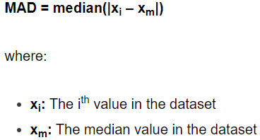

---
hide:
  - navigation
  - toc
---

<!-- title -->

    
&nbspAIOPSLAB

    
A 

<a href="https://aka.ms/m365research-org" class=textM365>M</a>

<!-- navigation -->

    

        
            <a href="https://www.bilibili.com" class="link-btn button" target="_blank">
                <i class="fa-solid fa-file-lines"></i>&nbspPaper
            </a>
        
        
            <a href="pages/leaderboard" class="link-btn">
                <i class="fa-solid fa-table-list"></i>&nbspLeaderboard
            </a>
        
        
            <a href="https://www.bilibili.com"class="link-btn" target="_blank">
                <i class="fa-brands fa-github"></i>&nbspCode
            </a>
        
    

<!-- news -->

    <h1 style="color: #4A90E2;">News</h1>
    
🆕 [ud" 👀
        <a href="https://www.bilibili.com" target="_blank">[Link]</a> 

    
🆕  '24 👀
        <a href="https://www.bilibili.com" target="_blank">[Link]</a> 

<!-- about -->

    <h1 style="color: #4A90E2;">About</h1>
    
.

    <!-- <h2 style="color: #4A90E2;">Data</h2>
    
Currently, the AIOPSLAB benchmark comprises 48 problems in its problem pool. These problems are categorized into four task levels: Level 1 to Level 4 correspond to detection tasks, localization tasks, RCA tasks (Root Cause Analysis), and mitigation tasks respectively. Each task level progressively increases in difficulty. The detection task (Level 1) involves binary classification where the agent must provide an answer of "yes" if a fault is present or "no" otherwise. The localization task (Level 2) requires the agent to precisely identify the location of faults typically within Kubernetes services or Pod names. The RCA task (Level 3) necessitates that the agent identifies system layers affected by faults and their types such as configuration errors or operational mistakes. The mitigation task (Level 4) entails interacting with the environment through a series of operations to rectify faults like updating configurations or rolling back to previous versions etcetera. 
 -->
    
    
<b>This is a overview of.</b> The Orchestrator coordinates iask.

<!-- BibTex -->

    <h1 style="color: #4A90E2;">BibTex ciation</h1>
    <pre><code style="color: #4A90E2;">@inproceedings{shetty2024building,
       nts-for-enabling-autonomous-cloud/}
    } 
    </code>
    </pre>

